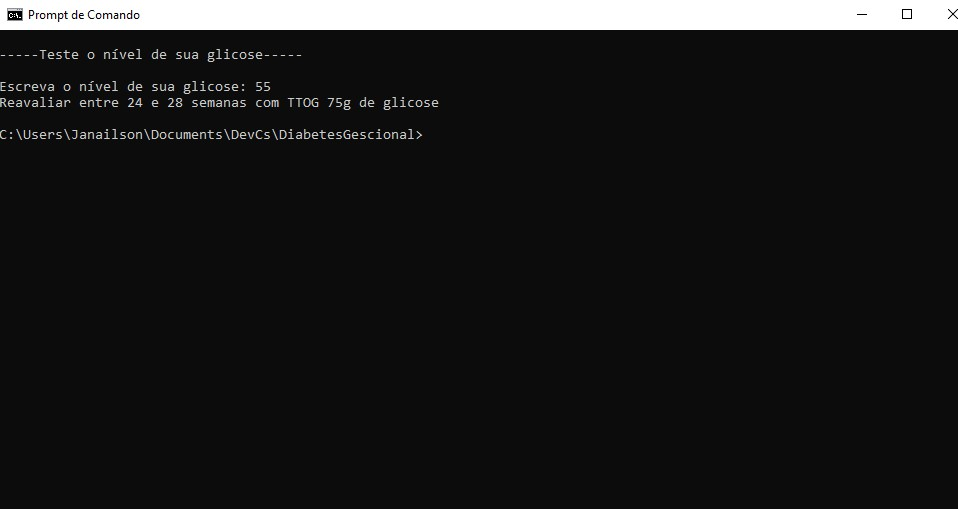

# DiabetesGescional

Veja um diagnóstico de uma Diabetes Gestional de acordo com o valor da glicemia(em mg/dL)


## Exemplo 

Exemplo da tela do programa:
```
-----Teste o nível de sua glicose-----

Escreva o nível de sua glicose: 55
Reavaliar entre 24 e 28 semanas com TTOG 75g de glicose
```


## _Screenshot_ 



## Donwload 

[Donwload do arquivo .zip](dist/DiabetesGestional.zip.zip)


## Agradecimentos

[Etec Adolpho Berezin](https://www.cps.sp.gov.br/etecs/etec-adolpho-berezin/)

[Ermógenes Palacio](https://github.com/ermogenes)

[Diego Neri](https://github.com/diegoneri)